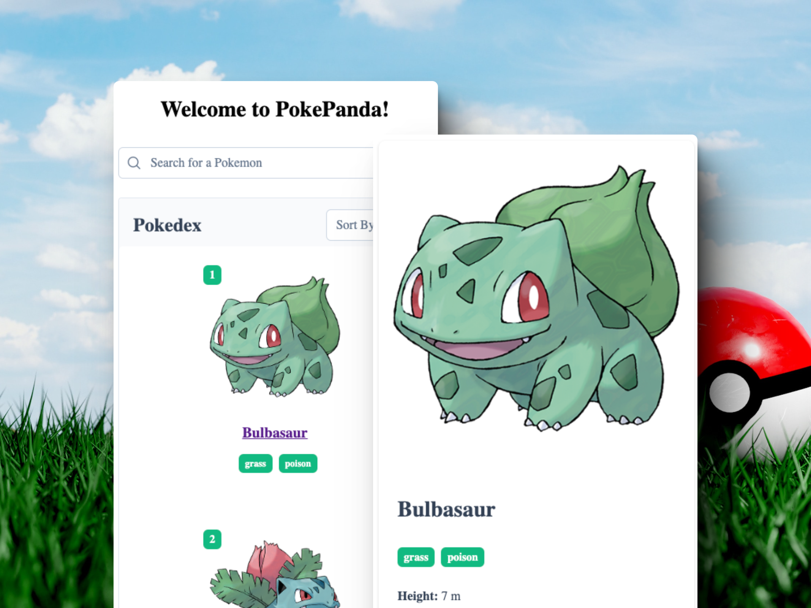

# PokePanda

[Demo Video](public/Demo.webm)



## Description

A web application to view and search for Pokémon using Vue 3 and PokeAPI.

## Technologies Used

- **Vue 3**: The main framework used for building the application.
- **TypeScript**: Provides static typing to enhance code quality and maintainability.
- **Vite**: A fast and lightweight development server and build tool.
- **Pinia**: For state management, offering a simpler API and better TypeScript support compared to Vuex.
- **PrimeVue**: A UI component library used for building responsive and visually appealing components.
- **PrimeFlex**: A CSS utility library used in conjunction with PrimeVue for layout and styling.
- **PrimeIcons**: Icon library for adding vector icons to the application.
- **ESLint**: For linting to ensure code quality.
- **Prettier**: For code formatting to maintain a consistent style.
- **Vitest**: A fast unit testing framework.
- **@testing-library/vue**: For testing Vue components in a way that resembles user interactions.
- **Apollo Client**: For making GraphQL queries to the PokeAPI.

## Installation

1. Clone the repository:

   ```sh
   git clone <repository-url>
   ```

2. Navigate to the project directory:

   ```sh
   cd pokepanda
   ```

### Using npm

3. Install dependencies:
   ```sh
   npm install
   ```

### Using pnpm

3. Install dependencies:
   ```sh
   pnpm install
   ```

### Using yarn

3. Install dependencies:
   ```sh
   yarn install
   ```

## Running the Application

### Using npm

1. Start the development server:

   ```sh
   npm run dev
   ```

2. Open the browser and navigate to `http://localhost:5173`

### Using pnpm

1. Start the development server:

   ```sh
   pnpm run dev
   ```

2. Open the browser and navigate to `http://localhost:5173`

### Using yarn

1. Start the development server:

   ```sh
   yarn dev
   ```

2. Open the browser and navigate to `http://localhost:5173`

## Building for Production

### Using npm

1. Build the application:

   ```sh
   npm run build
   ```

2. Serve the built application:
   ```sh
   npm run dev
   ```

### Using pnpm

1. Build the application:

   ```sh
   pnpm run build
   ```

2. Serve the built application:
   ```sh
   pnpm run dev
   ```

### Using yarn

1. Build the application:

   ```sh
   yarn build
   ```

2. Serve the built application:
   ```sh
   yarn dev
   ```

## Testing

### Unit Tests

### Using npm

1. Run unit tests:
   ```sh
   npm run test:unit
   ```

### Using pnpm

1. Run unit tests:
   ```sh
   pnpm run test:unit
   ```

### Using yarn

1. Run unit tests:
   ```sh
   yarn test:unit
   ```

## Decision Explanation

- **Vue 3 with TypeScript**: Leveraged for its static typing capabilities, which enhance code quality and maintainability.
- **PrimeVue and PrimeFlex**: Utilized for rapid and efficient UI construction, ensuring a responsive design.
- **PokeAPI**: Chosen for its robustness and ease of use, providing a comprehensive data set for Pokémon.

## Pending Items

- **Caching API Calls**: Improve performance by caching API responses.
- **Wireframes**: Create and include wireframes for the solution.
- **Demo Video**: Record and include a demonstration video of the working solution.
- **Unit Tests**: Write additional unit and integration tests to ensure application reliability.
